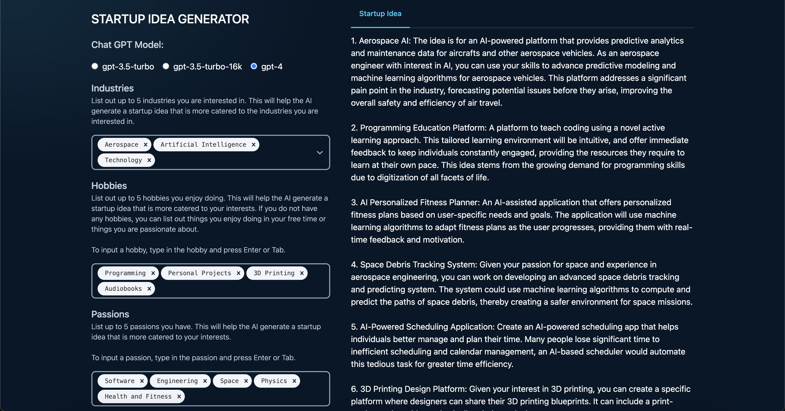

# Startup Idea Generator

## Description
An application used to generate startup ideas based off specific requirements passed in.

**NOTE**: The prompt is still being updated to provide the optimally phrased text to generate the startup ideas.

## Tech Stack


## OpenAI API Account Setup
This application requires setting up an API key for you OpenAI account. This is done through the URL below. When first setting up an account, at least at the time I made this app, an initial $5.00 is added for use for your first 3 months, after that, you have to fund you API account to allow for requests.

* https://platform.openai.com/account/api-keys

## Creating
This App was built using React.js and TypeScript. To setup the project, direct to the `startup-idea-generator` directory and run the following commands.

```
npm install
```

## Running
To start the app, run the following command from the startup-idea-generator directory.

```
npm start
```

**NOTE**: I might make this a single command to run.

## Application
The application uses ChatGPT to generate startup ideas based off form information.

It takes in details about what industry/type of the startup ideas, along with personal information to help tailor the ideas to the individual.

</img>
